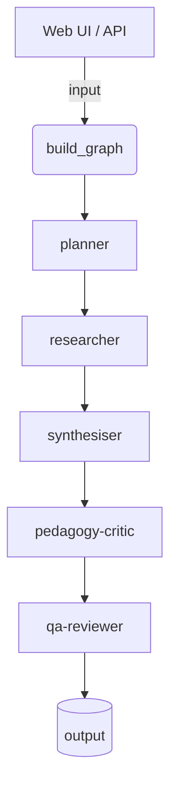

# System Architecture

This project orchestrates a sequence of five agents using LangGraph. The FastAPI application streams Server-Sent Events (SSE) back to the browser so users can watch each step in real time.

Each node wraps a small agent function decorated with `@langsmith.traceable` so token metrics and events are captured when LangSmith variables are configured.

## OpenAI Responses SSE streaming

The browser UI receives OpenAI responses as a continuous stream of events. Nodes yield tokens as soon as they arrive, providing near real-time feedback. The FastAPI service forwards these SSE events directly to the browser, so no WebSocket is required.

## LangGraph coordination

LangGraph manages the flow from planner through QA-reviewer. Edges between nodes define the order of execution and allow retries or branching if desired.

## SQLite persistence

Runs, versions, citations and log entries are stored in an SQLite database. The connection uses Write-Ahead Logging (WAL) so the graph can resume or replay deterministically.

## Deterministic replay

LangGraph checkpoints combined with WAL-enabled SQLite make it possible to replay any run exactly as it happened. This aids debugging and auditing.
