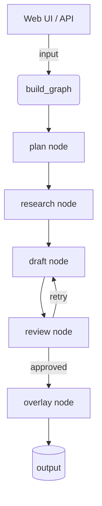

# System Architecture

This project orchestrates several agents via a langgraph flow exposed through a
FastAPI application. The web UI streams node outputs back to the browser so
users can observe each step in real time.

Each node wraps a small agent function decorated with `@langsmith.traceable` so
token metrics and events are recorded when LangSmith environment variables are
configured.

